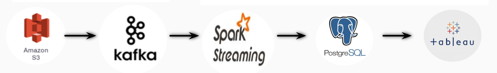
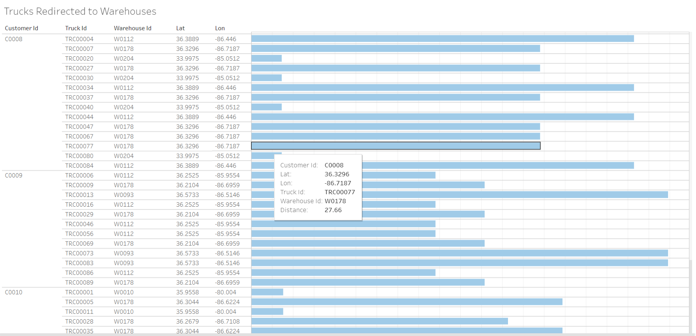
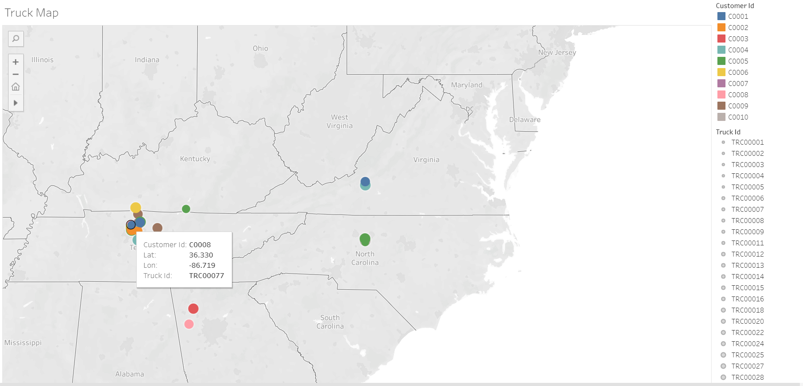

# Introduction

This project aims at building a streaming data pipeline for collecting IoT (Internet of Things)/ sensor data from fridges in the trucks in a cold supply chain and running analysis on this data. The data collected from the trucks contains customer Id, truck Id, latitude, longitude, temperature, humidity, load type of the truck and timestamp information. There is also a static data which contains information about warehouses namely warehouse Id, warehouse type, latitude and longitude. Collected data is processed in real time to determine if the trucks carry faulty load using some thresholds and if a truck has a faulty load, closest warehouse is found and the truck is directed to that warehouse so that the loads in that truck remain fresh.

## Motivation

Global IoT devices market is expected to grow to $ 310B and number of cellular IoT connections is expected to reach 3.5B in 2023. Supply chain industry has the 24% share in the market. In a cold supply chain, tracking the temperature and humidity of the products shipped via IoT sensors in real-time have utmost importance for the supplier and the consumer. 

## Technologies and Tools Used

1. Apache Spark Structured streaming
2. Apache Kafka
3. AWS S3
4. AWS RDS
4. PostgreSQL Database
5. Tableau

## Pipeline

Both the transport data (data collected from trucks) and the warehouse data are stored in S3. Then this data  is ingested by Kafka and a real time stream is created. This data is fed into Spark Structured Streaming. Faulty loads are determined and the trucks containing faulty loads are directed to the closest warehouse. The result is written into a PostgreSQL database.

## Dashboard

